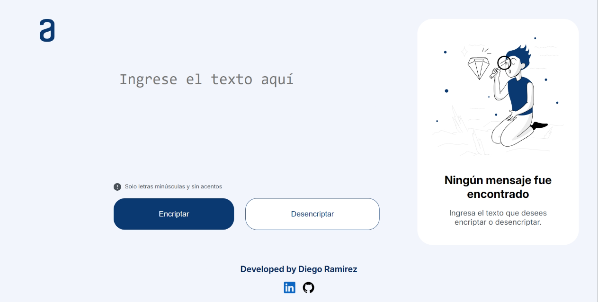
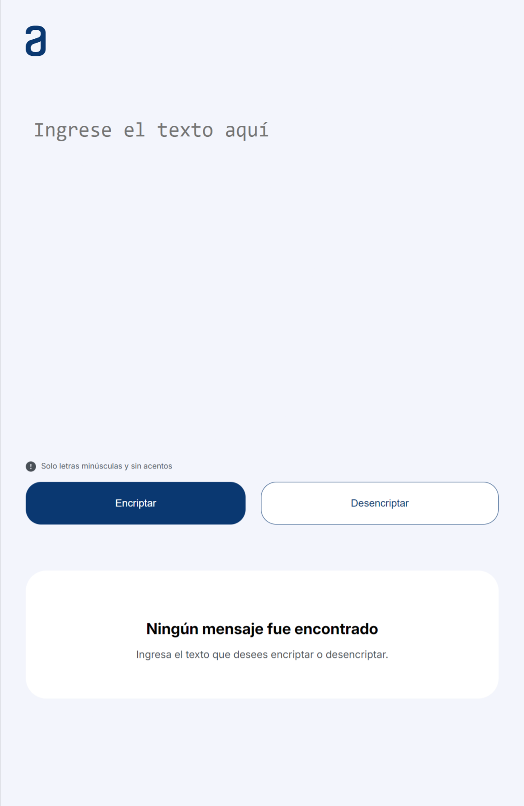
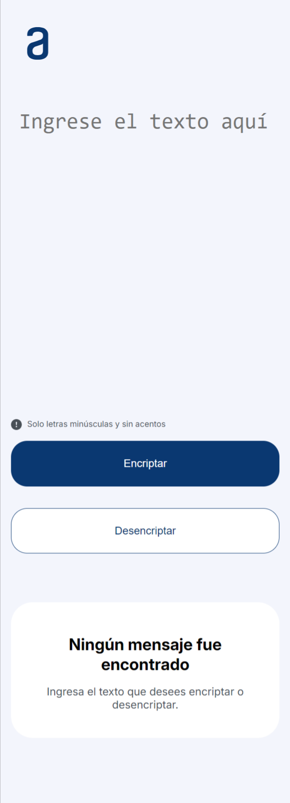

# Challenge - Encriptador de texto 

En este repositorio se encuentra la solución al primer reto de ALURA LATAM & ONE Oracle Next Education. El reto se basa en una aplicación que encripta textos.

Las "llaves" de encriptación utilizadas son las siguientes:
```
La letra "e" es convertida para "enter"
La letra "i" es convertida para "imes"
La letra "a" es convertida para "ai"
La letra "o" es convertida para "ober"
La letra "u" es convertida para "ufat"
```

Las características del encriptador son las siguientes:

- Funciona solo con letras minúsculas

- No permite letras con acentos ni caracteres especiales

- Es posible convertir una palabra para la versión encriptada y también devolver una palabra encriptada para su versión original.

  Por ejemplo:
  ```
  "gato" => "gaitober"
  gaitober" => "gato"
  ```
- La página contiene campos para inserción del texto que será encriptado o desencriptado, y el usuario puede escoger entre las dos opciones.

- El resultado es mostrado en la pantalla.

- Extras:
  Contiene un botón que copia el texto encriptado/desencriptado para la sección de transferencia, es decir, mantiene la misma funcionalidad del ctrl+C o de la opción "copiar" del menú de las aplicaciones.

## Interfaces

<p style="text-align: center; font-size: 12px"><em>Figura 1: Computadores.</em></p>
<div style="display: flex; text-align: center">
  <div style="height: 100%">
    
    <p style="text-align: center; font-size: 12px"><em>Figura 2: Tablets.</em></p>
  </div>
  <div style="height: 100%">
    
    <p style="text-align: center; font-size: 12px"><em>Figura 3: Smartphone.</em></p>
  </div>
</div>

## Demo
<video width="600" controls>
  <source src="assets/demo.mp4" type="video/mp4">
  Tu navegador no soporta la etiqueta de video.
</video>
<p style="text-align: center; font-size: 12px"><em>Figura 4: Demo.</em></p>

## Enlaces de interés

[Figma del reto](https://www.figma.com/design/trP3p5nEh7XUyB3n2bomjP/Alura-Challenge---Desaf%C3%ADo-1---L%C3%B3gica?node-id=0-1&t=J3eaw8cZjFaQHPC0-0)

[Página web desplegada](https://text-encrypter-vert.vercel.app/)


<small>Desarrollado por [Diego Ramírez](https://github.com/dieramirezma)</small>